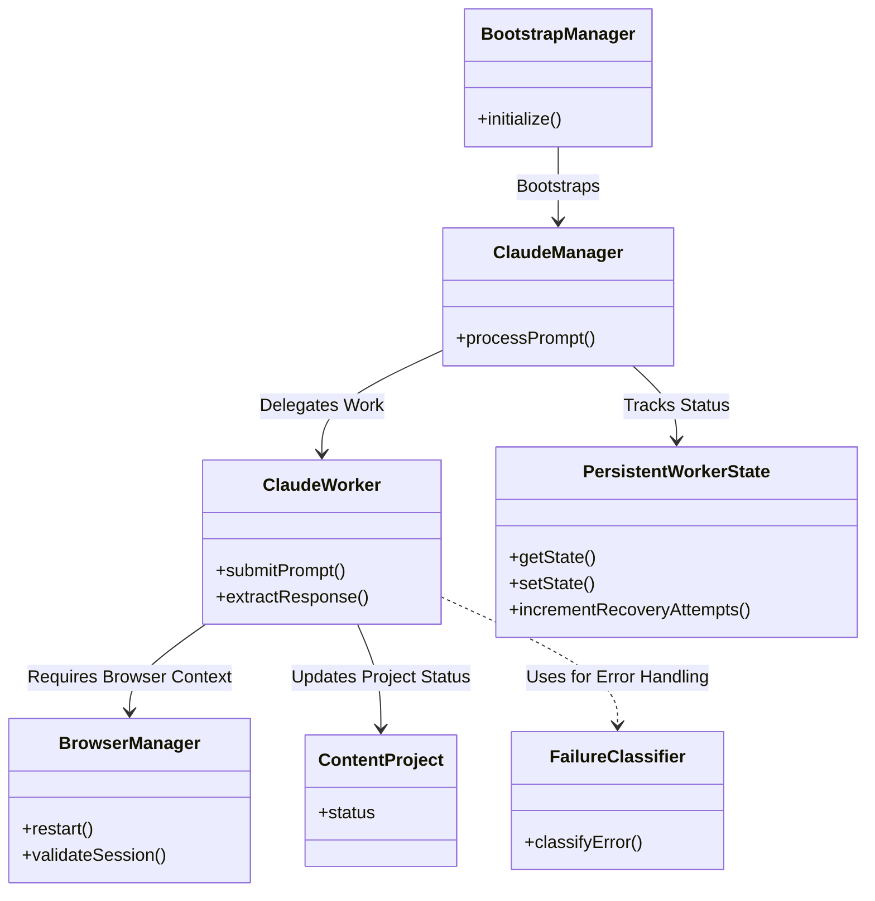

# Claude Worker Foundation

A reliable, scalable Playwright + Express worker designed for automating the Claude Web UI. This project provides a robust foundation for executing serialized prompts, managing browser sessions, and handling persistent jobs with sophisticated error recovery.

## 🌟 Overview

The Claude Worker Foundation is built to reliably automate interactions with the Claude web interface. It abstracts away the complexities of browser lifecycle management, session health monitoring, and stateful job processing.

### Key Features
* **Resilient Browser Management**: Automatically handles browser crashes, zombie processes, and session lock-ups.
* **Stateful Job Tracking**: Uses a persistent SQLite database (with an easy migration path to PostgreSQL) to ensure no tasks are lost.
* **Intelligent Error Recovery**: Built-in state machine that automatically retries processing upon transient failures.
* **Express API Interface**: Provides simple REST endpoints to interact with the worker and check system health.

## 🛡️ Anti-Bot & Evasion Techniques

This project implements advanced system design choices and specific anti-bot evasion techniques to reliably automate interactions with the Claude Web UI without triggering Cloudflare Turnstile or Claude's internal bot-protection systems.

### 1. Cloudflare Turnstile Evasion (Passive CDP Monitoring)
Most automation scripts fail at the Cloudflare Turnstile challenge because they actively poll the DOM (e.g., using `page.waitForSelector` or `page.evaluate`) to check if the challenge is solved. 
**Our Strategy:** Turnstile actively monitors and penalizes CDP (Chrome DevTools Protocol) DOM evaluation. To bypass this, our `ClaudeManager` avoids querying the DOM entirely while the challenge is active. Instead, it relies *passively* on network navigation events using `page.waitForURL`. This does not inject any evaluation scripts into the renderer, allowing the challenge to pass naturally as a human's browser would.

### 2. Stealth Plugin Initialization Fix
We utilize `playwright-extra` coupled with `puppeteer-extra-plugin-stealth` to spoof standard webdriver fingerprints (e.g., masking the `navigator.webdriver` flag, mocking WebGL, and adding missing plugins).
**Our Strategy:** A known flaw in Playwright's `launchPersistentContext` is that the stealth plugin often fails to hook into the very first automatically generated page. Our `BrowserManager` explicitly intercepts this: it closes the default zombie page immediately and spawns a fresh `context.newPage()`. This guarantees that the stealth scripts are injected into the execution context before any network requests are made.

### 3. Chromium Launch Argument Hardening
We strip standard automation flags that reveal the browser's automated nature to the target server.
**Our Strategy:** 
- We pass `--disable-blink-features=AutomationControlled` to prevent Chrome from announcing its automated state to the DOM.
- We utilize `ignoreDefaultArgs: ['--enable-automation']` to suppress the "Chrome is being controlled by automated test software" infobar and internal flags.
- We remove the sandbox (`--no-sandbox`, `--disable-setuid-sandbox`) to allow deeper OS-level execution without tripping restricted container heuristics.

## 🏛 Architecture

The following diagram illustrates the core components and their relationships based on the project's internal structure:



## 📂 Project Structure

- `src/server.js` - Application bootstrap and Express server setup.
- `src/bootstrap/BootstrapManager.js` - Coordinates initialization of services.
- `src/services/BrowserManager.js` - Persistent browser, context, and page lifecycle management using Playwright.
- `src/services/ClaudeWorker.js` - Serialized prompt execution and response extraction logic.
- `src/services/ClaudeManager.js` - Higher-level orchestration of Claude interactions.
- `src/models/WorkerState.js` - Explicit worker state machine (`PersistentWorkerState`) to track recovery.
- `src/models/ContentProject.js` - Job modeling and tracking statuses.
- `src/errors/ClaudeErrors.js` - Custom error types (e.g., `BrowserError`, `ProfileLockError`, `InvalidResponseQualityError`).
- `src/utils/FailureClassifier.js` - Intelligent classification of errors for recovery logic.

## 🚀 Getting Started

### Installation

```bash
npm install
```

### Running the Server

```bash
npm start
```
*(Or use `npm run legacy-start` for the legacy `server.js` entry point)*

### API Endpoints

Check system health and status:
```bash
curl http://localhost:3000/health
curl http://localhost:3000/status
```

Submit a prompt for processing:
```bash
curl -X POST http://localhost:3000/rewrite \
  -H 'Content-Type: application/json' \
  -d '{"prompt":"Say hello"}'
```

## 🔄 Recovery Flow

The system is designed with a fault-tolerant recovery flow:
1. **Request Reception**: Request arrives and is serialized in the queue.
2. **Validation**: `BrowserManager` validates the browser and page health.
3. **Execution**: If healthy, `ClaudeWorker` submits the prompt.
4. **Failure Handling**: If a failure occurs, `FailureClassifier` determines the root cause. The `PersistentWorkerState` tracks recovery attempts.
5. **Recovery**: If a session is broken, `BrowserManager` automatically restarts the session, and the job is retried until success or permanent failure.

## 🧪 Testing

Run the job system and validation test suite using Playwright and Jest:

```bash
npm test
```
