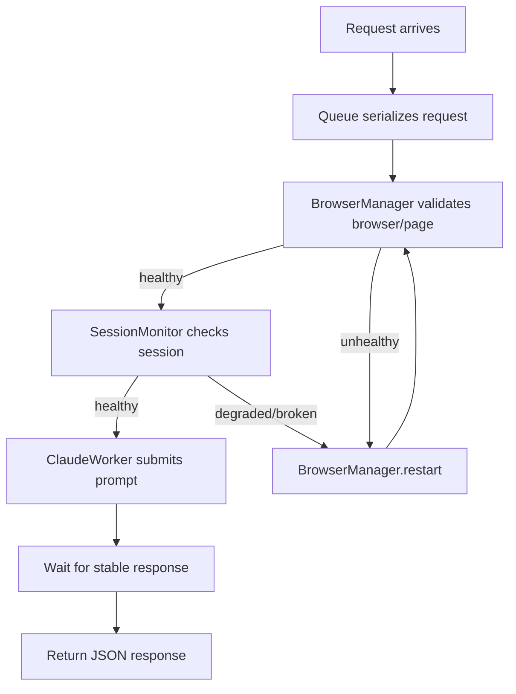

# Claude Worker Foundation

Reliable Playwright + Express worker for Claude Web UI automation.

## Structure

- `src/server.js` - application bootstrap
- `src/services/BrowserManager.js` - persistent browser/context/page lifecycle
- `src/services/SessionMonitor.js` - session health checks and recovery status
- `src/services/ClaudeWorker.js` - serialized prompt execution and response extraction
- `src/routes/rewrite.js` - `POST /rewrite`
- `src/routes/health.js` - `GET /health`
- `src/routes/status.js` - `GET /status`
- `src/state/workerState.js` - explicit worker state machine
- `src/config/config.js` - environment-driven config

## Run

```bash
npm install
npm start
```

## Endpoints

```bash
curl http://localhost:3000/health

curl http://localhost:3000/status

curl -X POST http://localhost:3000/rewrite \
  -H 'Content-Type: application/json' \
  -d '{"prompt":"Say hello"}'
```

## Recovery Flow



## Persistent Job System

The system includes a durable job tracking layer using SQLite to ensure that WordPress articles are processed exactly once and survive worker restarts.

### Schema (SQLite)

- `id`: INTEGER PRIMARY KEY AUTOINCREMENT
- `wp_post_id`: INTEGER UNIQUE (Duplicate prevention)
- `prompt`: TEXT (The content to process)
- `status`: TEXT (`pending`, `processing`, `completed`, `failed`)
- `created_at`: DATETIME
- `updated_at`: DATETIME
- `error`: TEXT (Stores error message if failed)

### Job Lifecycle

1. **Pending**: New job created via `POST /rewrite` with `wp_post_id`.
2. **Processing**: Background worker picks up the job and starts Claude automation.
3. **Completed**: Successfully processed article.
4. **Failed**: Error occurred during processing.
5. **Recovery**: On server startup, all `processing` jobs are reset to `pending` and retried.

### PostgreSQL Migration Path

To migrate from SQLite to PostgreSQL:

1. **Update Connection**: Replace `better-sqlite3` with `pg` (or `knex` for easier query building).
2. **Repository Pattern**: The `JobRepository` already uses parameterized SQL. Most SQLite syntax is compatible with PG.
3. **Schema Adjustment**:
   - Change `INTEGER PRIMARY KEY AUTOINCREMENT` to `SERIAL PRIMARY KEY`.
   - Ensure `DATETIME` is `TIMESTAMP WITH TIME ZONE`.
4. **Implementation**: Update `src/db/database.js` to use a PG pool.

### Testing

Run the job system test suite:

```bash
npx jest tests/job_system.test.js
```
